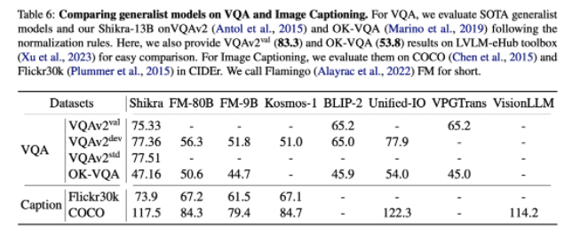

# “ Shikra：解锁多模态语言模型参考对话的魔法 🪄 ”

Shikra和用户的对话案例

- 在人类的日常交流中，经常会关注场景中的不同区域或物体，双方都可以通过说话并指向这些区域来进行高效的信息交换。我们将这种对话模式称为参考对话（Referential Dialogue）💬；
- 如果多模态大语言模型（MLLM） 擅长这项技能，它将带来许多令人兴奋的应用。例如，将其应用到 Apple Vision Pro 等混合现实 (XR) 眼镜中，用户可以使用视线注视指示任何内容与AI对话。同时AI也可以通过高亮等形式来提示某些区域，实现与用户的高效交流；
- 本工作提出了 Shikra 模型，赋予了MLLM这样的参考对话的魔法，既可以理解位置输入，也可以产生位置输出。
  
  

📃论文链接：http://arxiv.org/abs/2306.15195
⚙️代码链接：https://github.com/shikras/shikra 

***

## 01 工作亮点

Shikra 能够理解用户输入的 Point/Box，并支持 Point/Box 的输出，可以和人类无缝地进行参考对话；
Shikra 设计简单统一，采用非拼接式设计，直接使用数字表示坐标，不需要额外的位置编码器、前/后目标检测器或外部插件模块，甚至不需要额外的词汇表。

## 02 模型效果

比如上图，用户指着右边的女生问 Shikra：“这个人[bbox]的感受如何？” Shikra 回复说：“这个人[bbox]感觉到惊喜和高兴。我们可以根据：她用手[bbox]捂着脸，看着这个男人[bbox]送她一束花[bbox]推断出来。” Shikra 不仅推理正确，并且在提到关键视觉线索的时候还会提供在图上的坐标，这让沟通更加准确高效；

我们来看来自GPT4论文中的网红图片。相比GPT4的回复，Shikra 的回复不光 Get 到了图片的诙谐之处，还更确切地指出了每个需要被关注的目标的具体位置。作为对比，下面是GPT4的回答：

我们在下面再展示几个例子，更多的例子可以查阅 Paper。

比如 Shikra 会拼拼图，知道用户指出的拼图块应该拼到哪里。

用户指出两个区域， Shikra 会分辨出哪一个是镜像，哪一个是真身。

问 Shikra 这是不是兔兔🐰，她也不会上当，会指出这是一个小柴，只是穿着带着兔兔耳朵的衣服，在反驳时，Shikra 会一个一个指给你看

## 03 Box/Point 都行

对于输入输出模型还支持使用点（Point） 的形式，无论是电脑上的鼠标点击，还是Vision Pro的注视点，都用起来更加方便。下面是在PointQA数据集上的例子：

当然 Shikra 也支持Point的输出，比如Visual-7W中的例子，从诸多框中选择一个作为答案：

## 04 传统任务

参考对话（RD）是很多视觉-语言（VL）跨模态任务的超集，因此 Shikra 天然可以适配到不同的任务上，比如下面的表达式生成任务（REG），要为用户指定的区域生成图片中图一无二的描述：

这难不倒 Shikra，她正确地说出了这是一个坐着三个人的长凳。
另外我们可以看下VL领域经典的表达式定位任务（REC），要求模型定位出用户给出的表达式：

定位出背景中的人，定位出风筝的线，都没有问题。示例看的不过瘾？可以看看的在REC上的定量指标，Shikra 取得了很不错的成绩：

Shikra 也有一定的OCR能力，尽管没有专门在相关的数据上训练：

还有本工作定义的新任务，Spotting Captioning 任务，模型需要边描述图片边写出提到的物体的坐标，效果就像这样：

当然在最经典的 VQA 和 Image Captioning 的定量评价上，Shikra取得了 promising 的结果:

在最新的POPE评价指标上，Shikra 也表现不错，取得和InstrcutBLIP相当的结果，并远超近期其他MLLMs：

## 05 Shikra 原理

模型架构采用CLIP ViT-L/14 作为视觉主干，Vicuna-7/13B 作为语言基模型，使用一层线性映射连接CLIP和Vicuna的特征空间。
Shikra 直接使用自然语言中的数字来表示物体位置，使用[xmin, ymin, xmax, ymax] 表示边界框，使用[xcenter, ycenter]表示中心点，xy 坐标根据图像大小进行归一化，每个数字默认保留 3 位小数，这些坐标可以出现在模型的输入和输出序列中的任何位置，记录坐标的方括号也自然地出现在句子中。在论文中，本工作也尝试使用其他方式进行数值表示，并做了定量的对比实验，感兴趣的朋友可以查看论文。

## 06 新思维链形式

思想链（CoT），旨在通过在最终答案前添加推理过程以帮助LLM回答复杂的QA问题。这一技术已被广泛应用到自然语言处理的各种任务中。目前的MLLM还存在严重的幻视问题，CoT也经常会产生幻觉，影响最终答案的正确性。通过在合成数据集CLEVR上的实验，本工作发现，使用带有位置信息的CoT时，可以提升模型回答的准确率。

如果只用纯文本的CoT，模型性能反而会降低，甚至不如不用CoT的结果。但是在CoT中包含坐标信息，性能得到了提升，我们将这种新的 CoT 方式称为 Grounding-CoT（GCoT）。不过该探究仍然比较初步，仍是值得去论证的方向。

## 07 总结

本工作介绍了一种名为 Shikra 的简单且统一的多模态大语言模型，以自然语言的方式理解与输出空间坐标，为MLLM增加了类似于人类的参考对话能力，无需引入额外的词汇表、位置编码器或外部插件；
代码、模型、数据均开源在：https://github.com/shikras/shikra 

